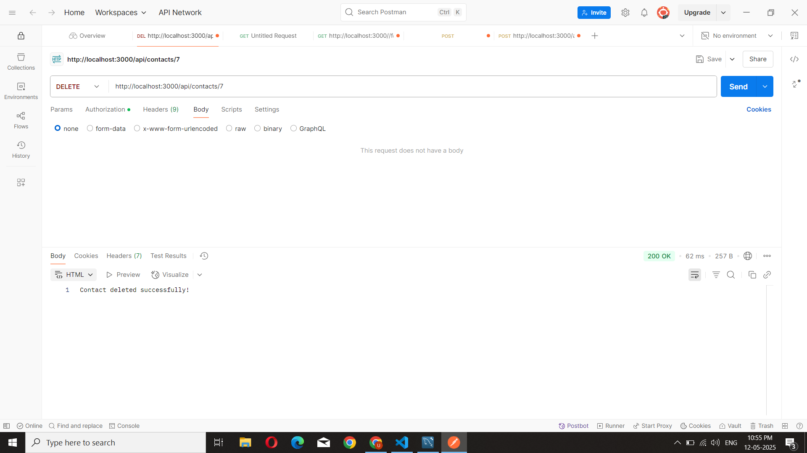

# 📇 Contact Management App

A simple Contact Management REST API built using **Node.js**, **Express**, and **MySQL**. It allows users to perform basic **CRUD operations** and includes **JWT-based authentication** for secure access.

---

## 🚀 Features

- 🔐 User Authentication using JWT
- 📄 Create, Read, Update, Delete Contacts
- 🧩 Middleware-based architecture
- 💡 Clean folder structure using MVC pattern
- 🧪 Tested with Postman

---

## 🛠️ Tech Stack

- Node.js
- Express.js
- MySQL
- JWT (jsonwebtoken)
- Body-parser
- Postman (for API testing)

---

## 📁 Folder Structure

```
project-root/
├── controllers/
│   └── contactController.js
├── routes/
│   └── contactRoutes.js
├── middleware/
│   └── auth.js
├── db.js
├── server.js
└── package.json
```

---

## ⚙️ Installation

1. **Clone the repository**

```bash
git clone https://github.com/your-username/contact-app.git
cd contact-app
```

2. **Install dependencies**

```bash
npm install
```

3. **Set up the MySQL database**

```sql
CREATE DATABASE contact_app;

USE contact_app;

CREATE TABLE contact (
  id INT AUTO_INCREMENT PRIMARY KEY,
  name VARCHAR(100),
  email VARCHAR(100),
  phone VARCHAR(20)
);
```

4. **Update `db.js` with your database credentials**

```js
const db = mysql.createConnection({
  host: 'localhost',
  user: 'root',
  password: '',
  database: 'contact_app'
});
```

5. **Run the app**

```bash
node server.js
```

---

## 🔑 Authentication

JWT token is required for accessing protected routes.  
Send it as a Bearer Token in Postman:

```
Authorization: Bearer <your_token>
```

---

## 📬 API Endpoints

| Method | Endpoint              | Description          |
|--------|-----------------------|----------------------|
| GET    | /api/contacts         | Get all contacts     |
| POST   | /api/contacts         | Add a new contact    |
| PUT    | /api/contacts/:id     | Update a contact     |
| DELETE | /api/contacts/:id     | Delete a contact     |

---

## 📸 Example (Postman)

**POST Request to Add Contact**
```
POST http://localhost:3000/api/contacts
Content-Type: application/json
Authorization: Bearer <token>

{
  "name": "John Doe",
  "email": "john@example.com",
  "phone": "1234567890"
}
```

---

## 📸 Screenshot



---

## 🧑‍💻 Author

- [Umashankari](https://github.com/Umashankari742)

---

